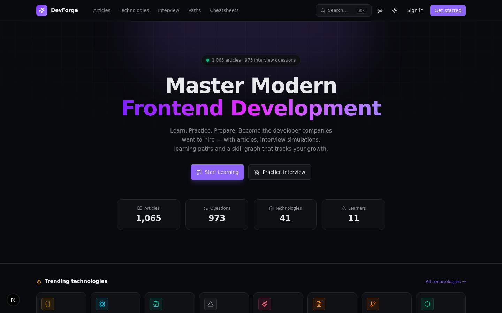
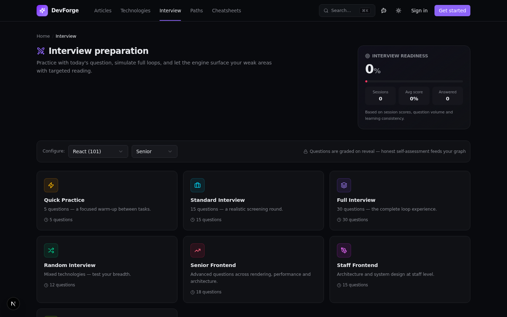
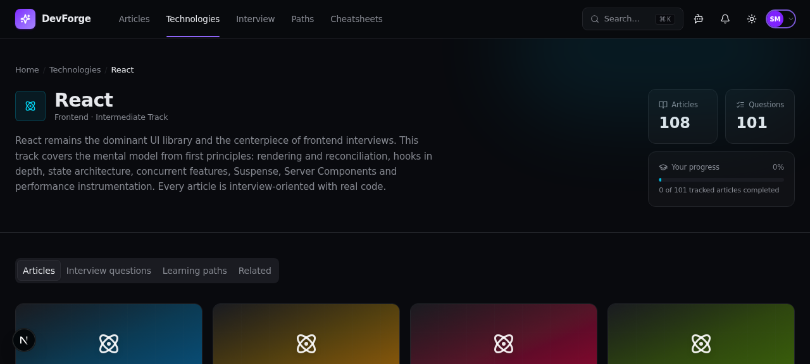
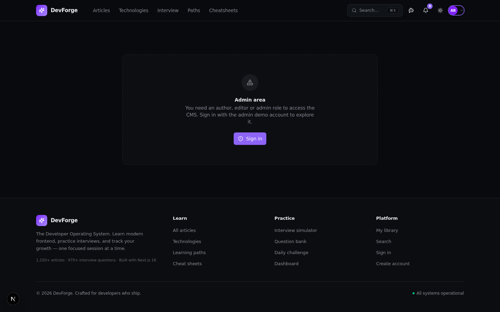
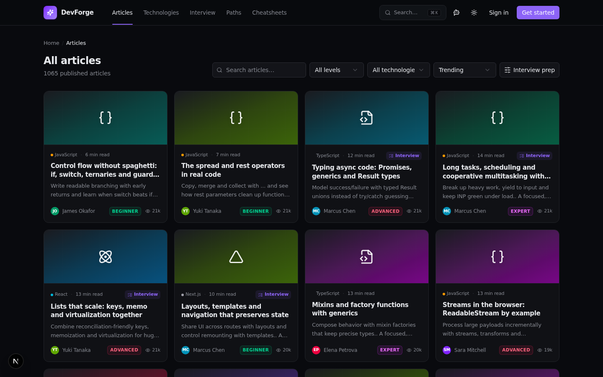
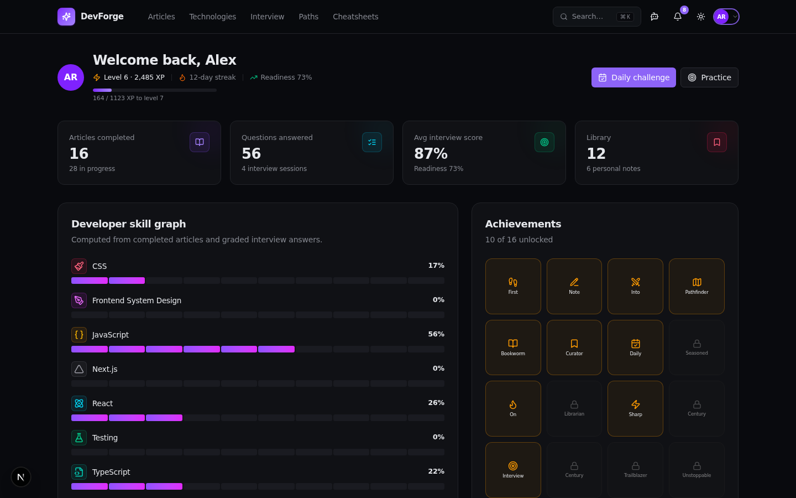
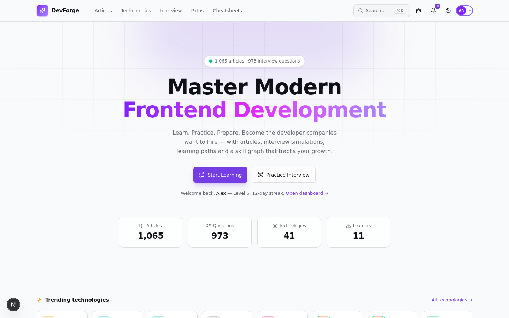
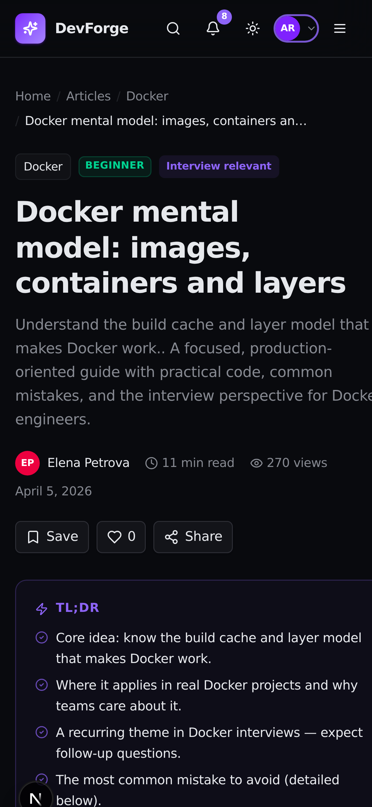

<div align="center">


# Dev Prep — The Developer Operating System

**A production-grade SaaS CMS + developer education & interview-preparation platform.**

Learn → Practice → Assess → Get hired → Keep growing — one connected product, zero fake affordances.

[](https://nextjs.org)
[](https://react.dev)
[](https://www.typescriptlang.org)
[](https://tailwindcss.com)
[-2D3748?logo=prisma)](https://www.prisma.io)
[](https://vitest.dev)
[](https://nodejs.org)
[](LICENSE)

</div>

---

## Contents

- [Highlights](#-highlights)
- [Screenshots](#-screenshots)
- [Quickstart](#-quickstart)
- [Demo accounts](#-demo-accounts)
- [Testing & code quality](#-testing--code-quality)
- [Production](#-production)
- [Stack](#-stack)
- [Project layout](#-project-layout)
- [Documentation](#-documentation)
- [Guest policy](#-guest-policy)
- [License](#-license)

---

## ✨ Highlights

| Area | What's inside |
|---|---|
| 📚 **Content** | 1,900+ published 11-section articles · 110 technologies in 6 categories · taxonomy (category → technology → tags) · cheat sheets · global search with history |
| 🎙️ **Interview engine** | 1,540+ questions · 7 modes (Quick 5 / Standard 15 / Full 30 / Random 12 / Senior 18 / Staff 15 / Daily 3) · immersive sessions · honest reveal-grading · readiness score · weak-area reading lists |
| 🌱 **Growth** | XP & levels · 107 achievements · streaks · daily challenge · notifications · per-technology skill graph · Junior→Staff career ladder |
| 🗺️ **Learning paths** | 170+ paths (flagship, per-technology & career roadmaps) · enrollment · per-item progress feeding the skill graph |
| 🔖 **Personal library** | Bookmarks, notes & highlights, reading history |
| 👤 **Profiles** | Public profile page for every user (bio, stats, published articles, social links) · owners edit their own profile, change password or delete their account |
| 🛠️ **CMS studio** | Role-gated admin: analytics overview, article editor with revisions & publish pipeline, question bank, **full user management** (create, edit, role assignment, password reset, remove + restore), taxonomy, settings |
| ⚙️ **Platform** | Session auth (scrypt + httpOnly cookies) · RBAC (5 roles) · guest mode with auth-gate · command palette (`⌘K`) · context-aware AI assistant (`⌘⇧I`) · dark/light themes · installable PWA · SEO (sitemap, robots, JSON-LD) |

## 🖼️ Screenshots

| Home | Interview simulator |
|---|---|
|  |  |

| Technologies & skill graph | CMS admin |
|---|---|
|  |  |

| Article page | Dashboard (XP · streaks · readiness) |
|---|---|
|  |  |

| Light theme · fully responsive | Mobile |
|---|---|
|  |  |

## 🚀 Quickstart

Requirements: **Node.js ≥ 22** (npm). No external services — the database is a bundled SQLite file.

```bash
# 1) install dependencies
npm install

# 2) configure the environment
cp .env.example .env        # defaults work out of the box

# 3) generate the Prisma client
npm run db:generate

# 4) create the SQLite schema and seed demo data
npm run db:push
npm run db:seed

# 5) start the dev server
npm run dev                 # → http://localhost:3002
```

> The repo ships with a pre-seeded `db/custom.db` — steps 4 can be skipped.
> `ADMIN_*` / `DEMO_*` credentials are consumed **only** from the environment
> (never hardcoded in the app).

### Demo accounts

| Role | Email | Password |
|---|---|---|
| Admin (SUPER_ADMIN) | `admin@devprep.dev` | `Forge-Admin-2026!` |
| Reader (USER) | `alex@devprep.dev` | `Demo-2026!` |

The sign-in page also offers one-click fill for both accounts.

## 🧪 Testing & code quality

```bash
npm run test            # 153 unit tests across 11 files (Vitest + RTL + jsdom)
npm run test:watch
npm run test:coverage   # v8 coverage report
npm run lint            # ESLint — 0 errors
npm run typecheck       # tsc --noEmit — 0 errors
```

Covered domains: hash router, scrypt auth + RBAC, interview scoring engine,
seed-generator determinism, Zod schemas, mappers, stores, design tokens,
and production units (health probe, robots/sitemap/manifest, JSON-LD graph).
Tests are hermetic — no database or network access required.

## 🏭 Production

```bash
npm run build     # standalone output + static assets copied in
npm run start     # production server (PORT env, default :3000)
```

Production-ready out of the box:

- **Standalone output** — `.next/standalone` is self-contained (server +
  minimal node_modules) and runs on any Node host or container
- **Security headers** on every response: `X-Frame-Options: DENY`, `nosniff`,
  `HSTS`, `Referrer-Policy`, `Permissions-Policy`; `X-Powered-By` removed
- **Health probe** — `GET /api` → `200 {"status":"ok","db":"up",...}` or
  `503 {"status":"degraded"}` for orchestrators
- **SEO** — `/robots.txt`, `/sitemap.xml`, Open Graph, schema.org JSON-LD
  (`Organization` + `WebSite` graph)
- **PWA** — installable manifest with maskable icons, dark theme colors
- **Auth hardening** — scrypt password hashing, 32-byte session tokens,
  httpOnly/secure cookies, server-side re-authorization on every action
- **~120–160 MB RSS** for the production server

## 🧱 Stack

Next.js 16 (App Router) · React 19 · TypeScript 5 (strict) · Tailwind CSS 4 ·
shadcn/ui + Radix · TanStack Query/Table · Zustand · Zod · Prisma + SQLite
(Postgres-ready) · Recharts · Framer Motion · Vitest + Testing Library ·
`z-ai-web-dev-sdk` (server-side only) · npm

## 📁 Project layout

```
src/
├─ app/               # Next.js entry · api/ · robots · sitemap · manifest
├─ features/          # domain views (home, articles, interview, admin,
│                     #   dashboard, library, profile, auth, ...)
├─ components/        # shell/ · shared/ · ui/ (shadcn)
├─ server/actions/    # 'use server' boundary (auth, content, interview,
│                     #   learning, ai, admin) + engagement side-effects
├─ lib/               # auth/RBAC · db · site/JSON-LD · design · slug · utils
├─ stores/            # zustand (ui panels, interview runtime)
├─ router/            # typed hash router (1:1 future file routes)
├─ types/ · hooks/ · providers/
└─ db/seed/           # deterministic composer + curated topic corpus
prisma/schema.prisma  # 31 models
tests/unit/           # 153 tests + hermetic stubs (no DB needed)
docs/                 # architecture deep-dives + full setup guide
```

## 📚 Documentation

- **Complete setup & usage guide (فارسی / Persian):** [`docs/GUIDE.fa.md`](docs/GUIDE.fa.md)
- **Architecture documentation (10 deliverables):** [`docs/architecture/`](docs/architecture/README.md)
  — product & technical architecture, database design, routing & state,
  auth/security, CMS, interview engine, recommendation AI, design system,
  roadmap

## 🤝 Guest policy

Guests can browse **every** article, question and model answer for free.
Starting a tracked interview session requires an account — the app opens a
friendly auth gate (*"an account is required to track your progress"*) and
returns the user to where they were after login (`?next=` flow). All
authorization is re-checked server-side; the gate is UX, not security.

## 📄 License

Released under the [MIT License](LICENSE).
"# Test" 
